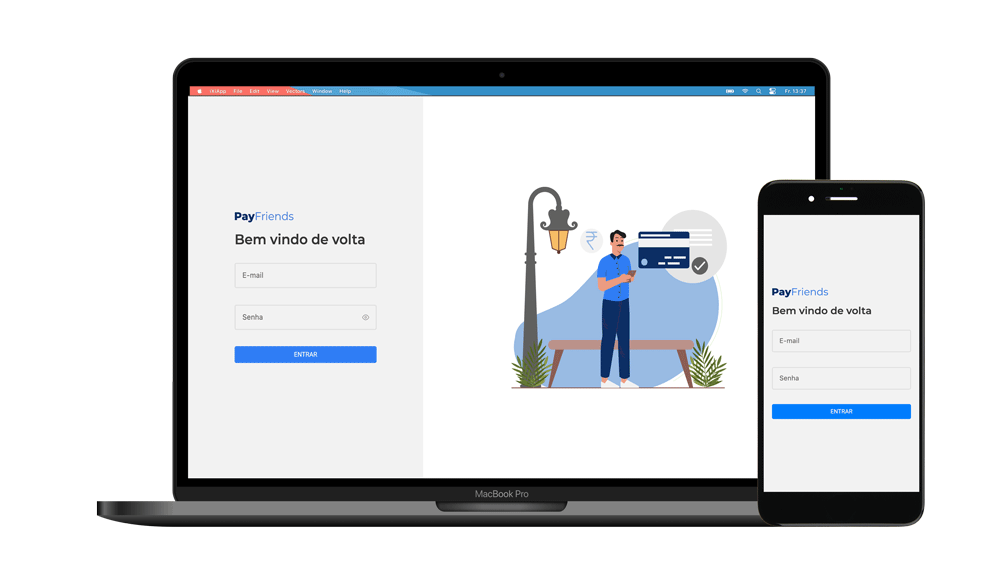
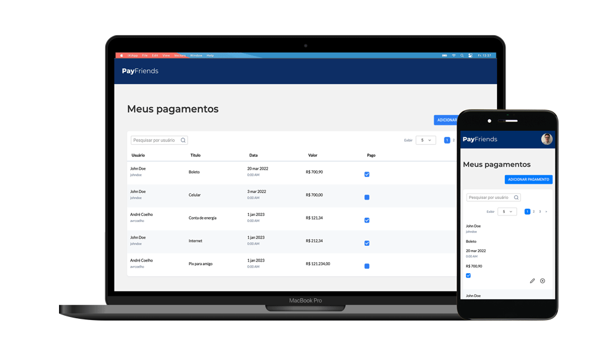

# Payfriends

<center>
  
  
<center>

## Sobre

Aplicação desenvolvida com o intuito de realizar o controle de pagamnetos.

## Tecnologias utilizadas

- [React](https://reactjs.org/)
- [Typescript](https://www.typescriptlang.org/)
- [Styled components](https://styled-components.com/)
- [Jest](https://jestjs.io/)
- [Testing Library](https://testing-library.com/docs/react-testing-library/intro)
- [React Hook Form](https://react-hook-form.com/)
- [Zustand](https://github.com/pmndrs/zustand)
- [Webpack](https://webpack.js.org/)
- [JSON Server](https://github.com/typicode/json-server)

## Execução

Tenha instalado em sua maquina o [Git](http://git-scm.com/) e [Node.js](http://nodejs.org/) 14.0.0 (ou superior). Caso prefira, instale o [Yarn](https://yarnpkg.com/).

1. Fork este repositório e crie um novo branch — ou crie um novo branch caso tenha permissão.

2. Depois de obter sua cópia local, acesse a pasta da aplicação e instale suas dependências:

```sh
npm install
```

ou

```sh
yarn
```

3. Execute o servidor da aplicação:

```sh
npm run jsonserver
```

ou

```sh
yarn jsonserver
```

4. Execute a aplicação em desenvolvimento:

```sh
npm start
```

ou

```sh
yarn start
```

Acesse: [localhost:3000](http://localhost:3000)

5. Autentique com o usuário de teste:

**E-mail:** johndoe@test.com
**Senha:** 123456

## Testes

Observação: Todos os arquivos de testes terminam com `.spec.tsx` ou `.spec.ts`

Acesse o diretório da aplicação e use comando abaixo para executar os testes:

```sh
npm test
```

ou

```sh
yarn test
```

## Build

Para criar o build da aplicação execute o comando abaixo:

```sh
npm run build
```

ou

```sh
yarn build
```

Os arquivos "buildados" estarão na pasta **dist** na raiz da aplicaão.

## Licença

[MIT](https://opensource.org/licenses/MIT)

Desenvolvido com ❤️ por [andrecoelho.dev](https://andrecoelho.dev)
